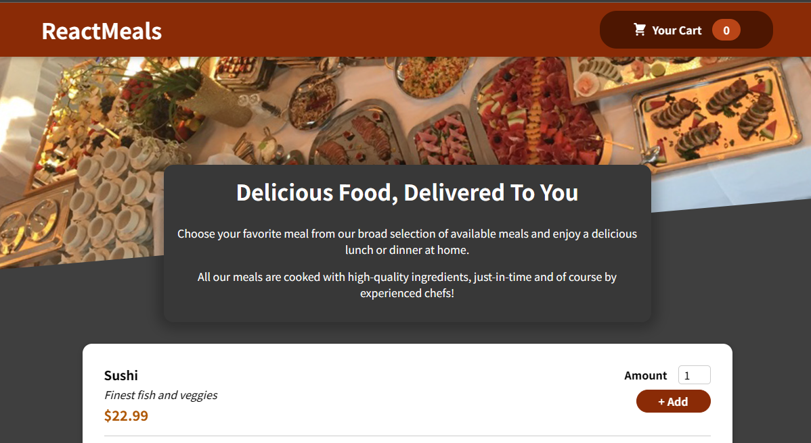

# Food Order Application
created using React.js, firebase,javascript.
# Dependencies
React. ReactDOM. NPM.
# Get Started
1.clone my Above Repository 
2.Open Terminal and run "npm install" Command 
3.to start, run "npm start"
# Hosted Website URL
